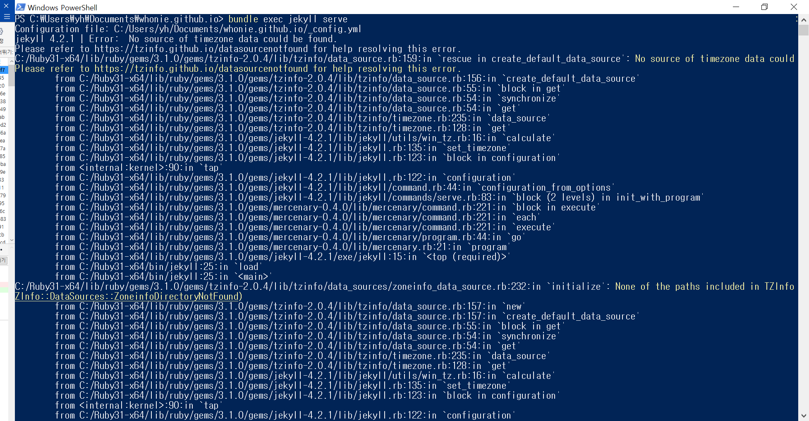

​	

# 문제상황

---

```config.yml```의 ```timezone```을 Asia/Seoul로 바꿨더니 powershell에서 다음과 같은 에러가 뜨면서 서버가 실행되질 않는다.



혹시나 로컬에서만 안되는거고 실제 github로 push 하면 작동되지 않을까 싶어서 push 해봤더니 여전히 먹통이였다. 

 


​	

# 시도해본 해결방법

---

구글링을 통해서 같은 문제점이 있는 사람들이 있다는 것을 알았고, 찾아낸 몇까지 해결방법을 시도해봤다.

​	

1. ```Gemfile```에 ```gem 'tzinfo'``` 와  ```gem 'tzinfo-data', platforms: [:mingw, :mswin, :x64_mingw]``` 를 추가.

   ```ruby
   source "https://rubygems.org"
   gemspec
   gem "webrick", "~> 1.7"
   gem 'tzinfo'
   gem 'tzinfo-data', platforms: [:mingw, :mswin, :x64_mingw]
   ```

   ​	

2. Powershell 에서 ```gem install tzifo``` 와 ```gem install tzinfo-data``` 를 실행

   .PNG)

​	

보통 여기까지 하면 거의 다 해결되는것 같은데 전혀 진척이 없었다. 이 두가지에 대한 더 자세한 해결방법은 다음의 [tzinfo 레포](https://github.com/tzinfo/tzinfo/wiki/Resolving-TZInfo::DataSourceNotFound-Errors)를 참조하라.


​	

# 해결방법

---

몇시간 삽질을 한 뒤에 위의 Powershell 오류 내용에 나와있는 내용을 바탕으로 직접 해결방법을 찾기로 했다. 

위의 공식문서에서  tzinfo에 관한 보다 자세한 내용이 담긴 [페이지](https://rubydoc.info/gems/tzinfo/TZInfo/DataSource.set)를 찾을 수 있었다. 추측해보건데 내 로컬 ```ruby``` 환경에 ```tzinfo```에 관한 몇몇 파일들이 누락돼있는게 아닐까 싶었다.


​	

### 필요한 tzinfo 레포를 로컬로 클론

---

github에 올라와있는 [tzinfo 레포](https://github.com/tzinfo/tzinfo ) 를 포크하고 내 로컬환경에 클론했다.

​	

### 폴더, 파일을 로컬의 ruby 폴더로 복사

---

에러메세지에 나온 내 ruby 설치폴더 디렉토리인

```C:\Ruby31-x64\lib\ruby\gems\3.1.0\gems\tzinfo-2.0.4\lib\tzinfo```을 열어보고

공식 레포에서 클론한

```C:\Users\유저이름\Documents\tzinfo-data\lib\tzinfo```

을 열어서 비교하며 내 로컬 ruby 환경에 없는 파일들을 싹 다 복사해줬다.   

