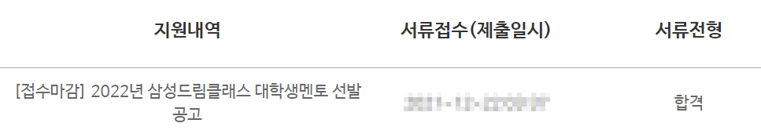
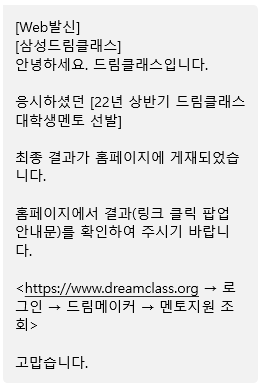

​	

# 서류전형

나는 드림클래스 2019년 여름캠프, 2020년 겨울캠프에 지원한적이 있다. 2018년엔 운좋게 전화찬스(추가합격)을 받았으나 결국 일정이 맞지 않아 활동하지 못했고🤦‍♀️ , 2019년도엔 서류탈락했다.😢 2018년도에 합격한건 지금 생각해봐도 내가 잘해서 합격한게 아니라 정말 그야말로 운이 많이 좋았었던거고, 2019년도에도 서류가 미비해서 추가제출하는 등 부족한점이 정말 많았다. 그런 경험들을 반면교사삼아 이번에는 정말 열심히 준비해보고자 했다.💪

## 🧾활동경력사항, 어학 정리

전에 지원했을때와 **자소서 문항이 조금 달라졌는데**, 아마 드림클래스가 오프라인 국영수 교육에서 온라인 중심의 멘토링 활동으로(교육이 아니다) 전환되면서 그런것 같다. 대표적으로 과외 경력과 수능 점수(등급은 여전히 기재한다)를 묻는 문항이 없어졌다.

활동경력사항에는 수상경력, 교육봉사, 동아리활동, 기타 의 항목을 기입할 수 있으며 총 10개의 항목까지 기입할 수 있다. 

- 교육봉사 경력은 당연히 플러스가 되는 내용이기에 나는 서울동행 프로그램을 했던 경력을 넣었다.
- 나머지 항목들은 적을지 말지 애매할 수 있는데, 나는 일단 **드림클래스와 무관해보이는 활동이라도 최대한 10개를 다 넣고자** 했다. 돌이켜볼 때 이는 면접과 서류전형 모두에서 좋은 선택이였다.
- 알바 경험은 기타 활동으로 모두 넣었다. 학원 알바는 물론이고 스키강사로 활동한 이력도 넣었다. 동아리 활동도 EXIT(댄스동아리), 학생회 등 모두 적었다.

## 🧾자기소개서 준비

### ✔지원동기

교육봉사 경험을 녹여냈다. 중학생 아이들을 대상으로 수업을 진행할 때, 기간이 너무 짧다보니 할 수 있는게 제한적이였고, 보다 장기적으로 활동하고싶다고 했다.

### ✔성장과정

정말 말 그대로 0세부터 지금까지의 일대기를 적는게 아니라, **인생의 중요 터닝포인트를 위주로 서술**하는게 주요할것 같다. 나의 삶의 발자취를 따라가며 나를 어필할 수 있는 포인트를 담아내는게 중요하다. 이 때 어필할 수 있는 포인트는 뭐 스펙, 활동경력 그런걸 말하는게 아니다(그건 이미 위의 활동경력사항에서 충분히 어필했다). 이렇게 말하면 조금 추상적으로 들릴 수 있지만, 나의 성향, 스타일, 관심사를 담아낼 수 있어야한다.

### ✔성격의 장단점

다양한 시도를 두려움 없이 하는게 장점, 그러나 한편으론 한 우물을 꾸준히 파지 못한다는게 단점. 그러나 이 또한 최근 진로탐색분야를 특정하고 한 분야로만 집중해서 공부하며 단점을 보완해나가고 있다고 적었다.

### ✔리더십

리더십 문항이 나올때마다 캠퍼스라이더 경험을 녹여내는데, 역시나 이번에도 그랬다. 좋은건지 나쁜건진 모르겠지만 리더십이라고 하면 캠퍼스라이더밖에 떠오르지 않는다.

​	

# 면접전형

조마조마하게 기다렸는데 저녁이 다 되도록 합격문자가 안와서 떨어졌구나 생각했다(보통 합격자들에겐 홈페이지에서 결과를 확인하라고 알려주기에). 저녁에 반쯤 포기한 마음으로 드림클래스스 홈페이지에서 조회를 해보니 서류전형을 통과했다고 떴다. 😊

BOAZ 면접에서 고배를 마신지 얼마 되지 않았기때문에 바로 면접준비에 돌입했다.

## ✔BOAZ 면접에서 떨어지며 배운것

대학생 빅데이터 연합동아지 BOAZ 면접을 경험하며, 나는 면접을 정말 못한다는걸 깨달았다. 조금 늦었긴 했지만 패착을 분석했다. 정말 당연한 이야기지만, **당연히 자소서를 바탕으로 나올 질문을 철저하게 대비하는게 우선**이다. 그게 완벽하게 되면 그 다음에 기술, 학습에 관한 질문을 대비해야 한다. 근데 나는 정확히 반대로 했고, 그래서 코세라 강의 복습만 주구장창 하고 정작 내가 자소서에 기입한 내용에 대비하는데 소홀했다.

## ✔그래서 철저하게 지원서 위주로 준비했으나

지원서의 경력사항란과 자기소개란의 모든 내용을 되짚어가며 예상질문을 만들고 대비했다. 국회에서는 정확히 어떤 일을 했는지, 서울동행에서는 무슨 과목을 어떻게 가르쳤는지, 심지어 EXIT 활동에 관해 물어볼까봐 아낀다 안무를 복습해보기도 했다. 이렇게 **자소서 중심으로 면접 대비**를 하다보니 그래도 그나마 면접관의 입장에서 무엇이 궁금할까 조금 알것같았다.

## ✔실제론 이런 질문이 나왔다

이렇게 열심히 준비했지만, 사실 지원서의 내용을 중심으로 한 질문이 그렇게 많이 나오지는 않았다. 오히려 모든 지원자에게 물어보는 공통질문의 비중이 컸는데, **교실에서 일반적으로 일어날만한 상황을 가정하고 어떻게 대처할것인지 물어보는** 질문이 많았다. 자소서 관련 질문을 하실때는 다양한 활동들을 적극적으로 한것을 긍정적으로 평가해주신것 같다. 학점이 낮아서 관련 질문이 들어올까 걱정했었는데 다행히 문제삼진 않으셨다. 특히 저번 BOAZ 면접 때 로열티 어필에 매우 부족했다는 생각이 들어서 이번에는 **로열티를 어필하기 위해 노력**했다. 많은 활동들을 해왔는데 올해는 계획한 활동이 없냐고 여쭤보셔서 *드림클래스를 위해* 다른 대외활동 일정은 전혀 잡지 않았다고 말씀드렸다.

# 최종합격

또다시 면접준비를 잘 하지 못했다는 생각이 들어 이번에도 탈락인가 낙심하며 기다리고 있었는데.. 이번에는 문자를 받았고 실제로 확인해보니 합격이였다!!😊

후에 활동하며 느낌점을 계속 써내려가도록 하겠다.

