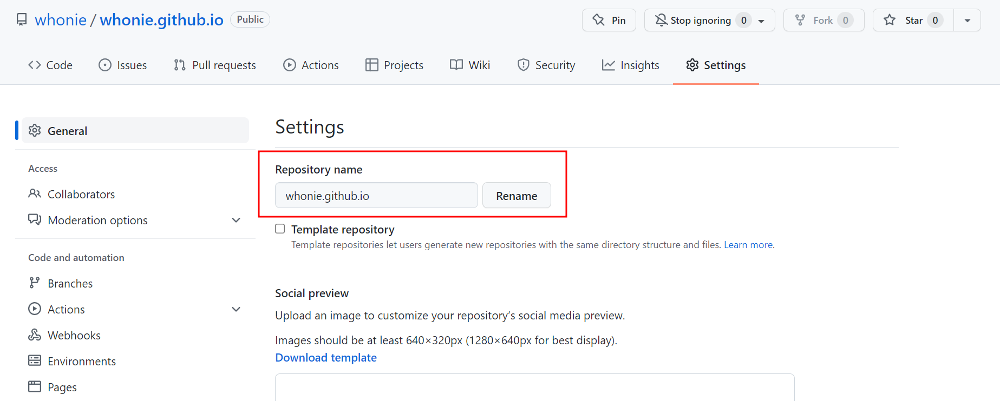
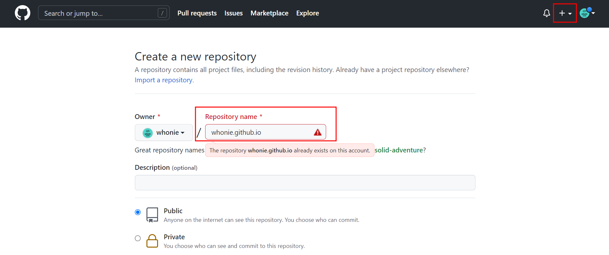
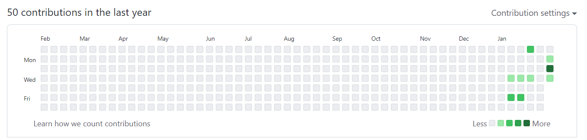

​	

# 😫문제상황

---

이 블로그는 minimal mistakes 테마를 **포크해서** 만들어졌다. 이게 포크해서 그런건지는 확실하지 않지만, 여하튼 블로그 commit 내용이 깃헙 잔디심기(commit log)에 반영이 되지 않는 문제가 있다.

​	

# ✌해결방법

---

구글링을 통해 찾은 여러가지 해결책들을 시도해봤다.

1. 새로운 브렌치를 파서 거기로 commit/push를 하고 나중에 master로 merge. [이 영상](https://www.youtube.com/watch?v=Z053Qn8LJyk&list=PLIMb_GuNnFwfQBZQwD-vCZENL5YLDZekr&index=13)을 참고했다.

   장점 : 일단 commit log를 남길수는 있다.

   단점 : 매 포스팅마다 저걸 해줘야해서 몹시 번거롭다. 또 commit log자체도 그냥 pull request를 했다고 떠서 정확히 몇개의 commit을 했는지 한눈에 알아보기 어렵다.

2. 임시 레포로 bare clone 하고 그걸 다시 원래 레포로 mirror push. [여기를](https://soranhan.tistory.com/11) 참고했다

   단점 : 일단 내 경우엔 기존 commit 내용 자체도 옮겨가지 않았으며 시험삼아 몇개의 commit 만들어봤는데 이것들도 전혀 반영되지 않았다. 

결국 삽질을 거듭하다가 아래의 방법으로 해결했다.

​	

## ✔기존 레포 이름 변경

레포의 settings에 들어가서 레포 이름을 변경해준다. 어차피 이 레포는 이제 작업이 끝난 후 삭제할 레포라 아무거나 상관없다.

​	

## ✔새로운 레포 만들기

그 뒤에 새로운 레포를 하나 파준다. 저 아래의 빨간 에러메세지는 위처럼 이미 기존 레포의 이름을 바꿨다면 뜨지 않을것이니 무시해도 좋다.

​	

## ✔새로운 레포로 push

이제 새로운 커밋거리를 하나 만들고 원격저장소로 push를 하자. terminal, sourcetree등 뭐든 좋다.

그럼 이제 *새로 만든*(xxx.github.io의 이름을 가진) 레포에 기존 블로그의 내용이 그대로 올라갔을것이다. github에서 확인해보라. 그리고 블로그가 잘 동작하는지 확인이 되면 기존의 레포(이름을 바꿨던)는 삭제해줘도 된다.

잘 됐다면 이제 commit을 하는대로 바로바로 잔디밭이 채워질것이다.

올해 꼭 저 잔디밭을 풍성하게 만들어야지 ㅠㅠ