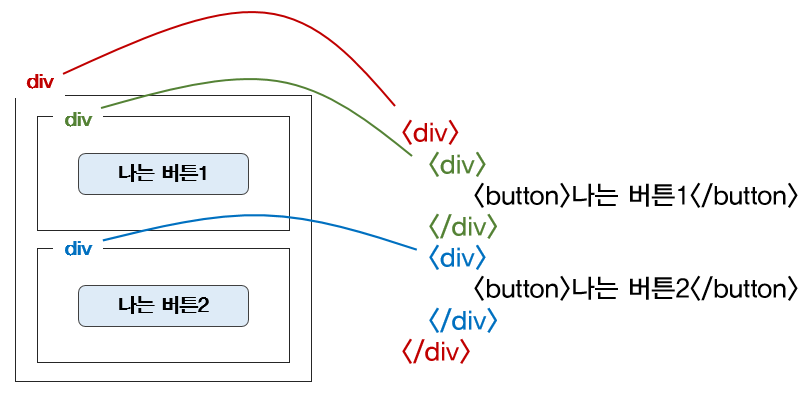

# 1-6


html은 뼈대

css는 꾸미기

javascript는 움직이는 모든것

탭 아래에 있는 영역은 모두 body. 따라서 css로 꾸며주는 것들도 body안에 있다. 하지만 body안에서 바로 꾸며주는건 아니고, class를 사용해 body 안에 있는 테그들에 "이름표"를 붙여주고, head에서 이 "이름표"를 이용해서 style테그로 어떻게 꾸며줄지 정한다.

html테그는 기본적으로 *감싸는것*. ` <p></p> ` 라고 사용해도 물론 띄어지기는 하지만, `<p> <테그> <테그/> </p>` 라고 쓰는게 더 명확할듯.



이제 div테그가 쫌 이해가 간다. css로 div 테그 하나면 꾸미면 그 아래있는 모든 테그들이 다 영향을 받을것이다. 왜 div를 묶어주는 테그라고 했는지 이해가 감.

이미지 삽입할 때

```html
background-image: url("xxx.jpg");
background-size: cover;
background-position: center;
```

이렇게 3줄이 같이다임. intro to creative computing 에서 p5js로 한게 도움이 된다. 어떤 원리로 되는건지(계산법)은 차차 필요할때마다 학습하면 될듯.

margin과 padding의 차이.

* margin은 *밖에서부터의 여백*. 
* padding은 *안에서부터의 여백*.

이러한 차이때문에, padding은 앞서서 직접 `width` 나 `height`를 설정했더라도 이게 무시될 수 있다. 예컨데, 이게 `div`에 걸려있고,

```html
width: 300px;
height: 200px;

padding-top: 100px;
```

라고 하면, *padding은* `div` 안에서부터 100px이기 때문에, 결과적으로 요소의 크기가 위쪽으로 늘어날 수 밖에 없다.

반면 같은 상황에서 `margin-top`이 100px이라고 하면 div를 그대로 아래도 100px 내리는것이기 떄문에 요소의 크기가 변하지 않는다.

그리고 여기서의 요소는 `div`다. div 아래에 있는 다른 기타 테그(h 등)이 아니라.

한 요소에 class를 두개 붙일수도 있다.  그냥 space 하나 두고 연달아서 써주면 된다.이걸 중첩이라고 한다.

​	

# 1-7, 1-8

부트스트랩 이용법. 그냥 head에 다 넣어주고 body에서 자유롭게 쓰면 됨.

근데 예컨데 버튼을 가운데로는 어떻게 옮기냐? 그건 이제 가져온 css에 *중첩*을 하든지, div로 묶어서 처리.


# hw(2022-02-11)

일단 이미지 붙이는 방식은 정형화하자.

```html
<body>
<div class="pic"></div>

<head>
       backgroundimage:url("");
       background-position: center;
       background-size: cover;

```

이렇게 묶어서 다니는걸로.


그리고 기획단계에서 어디서부터 어디서까지 하나의 div로 묶을지 정하고 시작하자. 그리고 다 끝난 뒤에 wrap으로 묶어서 가운데로 이동시키자.

버튼은 margin : auto해도 가운데로 안간다. dispay : block해주자.

body에서 css약간 처리 가능함. 그걸 inline css라고 하는데, 재사용성이 낮음.

div안에서 div를 중첩하는것, 그리고 class두개 쓰는것 두려워하지 x. 예컨데 폼 맨 아래에 버튼 넣어주고, 그 버튼에 대한 기능은 class 중첩시켜서 해결하면 됨.

`<span>`은 이제 뭐 어떤 테그 안에서 크기 등 바꿀 때 사용.

재밌고, 동시에 어렵기도 하다!!

---

slack qna하면서 배운것 :

#명시도 #태그선택자 #전체

테그에 CSS를 적용하는 방법에는 여러가지가 있다. 일단 내가 배운건 class로 연결하기.

`<head>`의 `<style>`에 `.styleName { ... }` 적고 해당 class를 `<body>의 필요한 tags에 연결하는게 class로 연결시키는거다.

여러 방법들을 중첩시키면, 우선순위에 따라 적용된다..! 


메모:

다만 그렇다면 왜 line32의 `<div>` 안의 `<h1>`은 왜 제가 전체선택자로 넣은 폰트가 지정됐는지는 여전히 잘 모르겠습니다.
제가 생각했을땐 `<div>`안에 걸려있긴 하지만, `<head>` 에서 해당 `<div>`에 연결된 class가 없으니 뭘 달리 적용받는것(?) 같지는 않고, `<h1>` -> `<div>` -> `<body>`의 순서로 올라가면 line32의 `<h1>`도 마찬가지로 헤드태그니 부모의 폰트값을 상속받아야 하고 