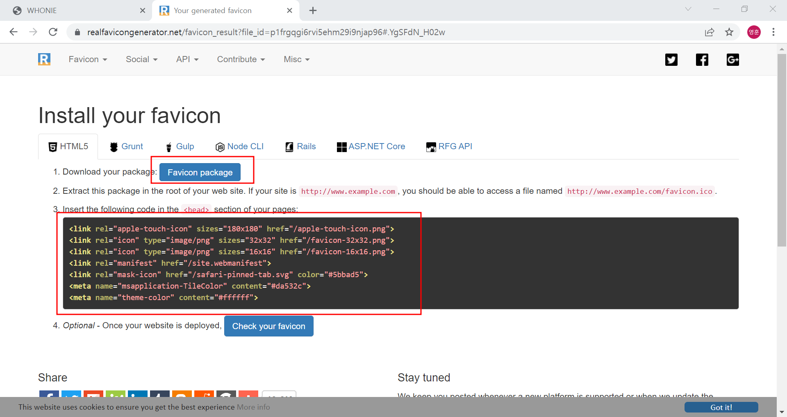
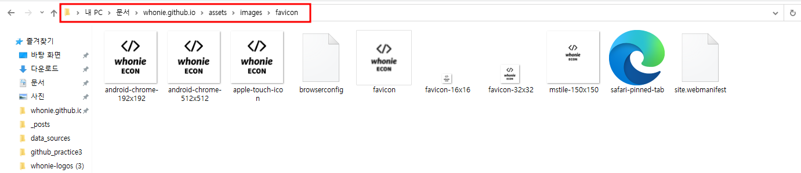
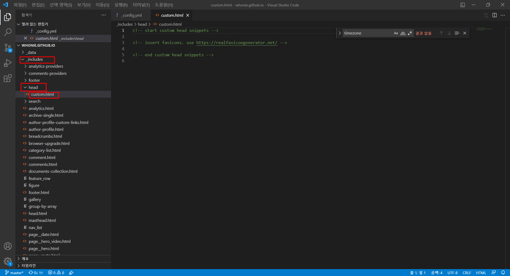
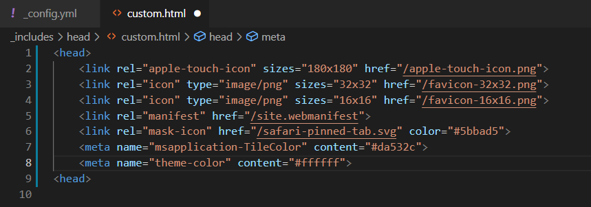
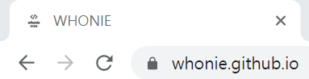

​	

# favicon이 뭔데

---

favicon은 그림처럼 탭의 웹사이트 옆에 뜨는 아이콘이다. 사실 favicon이란 용어 자체도 몰라서 구글에 '탭 옆의 아이콘' 이런식으로 검색했었다. 따로 지정하지 않으면 저런 기본 아이콘이 뜨는데, 사실 탭을 여러개 열었을때는 어떤 탭이 내 블로그인지 바로 알기가 어려워서 불편했었다.

만드는 과정에서 다음의 [글들을](https://ohjinjin.github.io/blog/favicon/) [참조했다](https://danggai.github.io/github.io/Github.io-%ED%8C%8C%EB%B9%84%EC%BD%98-%EC%88%98%EC%A0%95%ED%95%98%EA%B8%B0/)

​	

# 설치과정

## 온라인에서 favicon 만들기

갖고있는 jpg나 png등을 바로 favicon으로 사용할 수는 없고 favicon으로 쓰일 수 있는 파일로 변환해야 한다. 나는 [여기](https://realfavicongenerator.net/)에서 만들었다.

쭉 진행하다 보면 아래와 같은 화면이 나온다. 먼저 다운로드를 해야하고, 다운받은 뒤에 창을 닫으면 안된다. 나중에 저 html코드를 써야한다.

 

​	

​	

## 로컬의 블로그 폴더로 압축해제

다운로드한 패키지를 블로그의 원하는 경로로 압축해제한다. 나같은 경우에는 `/assets/images/favicon` 이란 디렉토리를 만들어줬다.

​	

​	

## 블로그 `custom.html`에 코드 추가하기

아까 위의 웹사이트에서 봤던 html 코드를 내 블로그 파일 내의 `custom.html`에 붙여넣기한다. 파일은 `includs/head/` 에 있을것이다.

이런식으로 기작성된 각주를 지우고 `head테그`를 만들어 그 안에 넣기만 하면 된다.

만약 favicon 파일들을 블로그 최상단 root에 넣어놨으면 이대로 쓰면 된다.

하지만 나는 favicon이 저장된 위치를 바꿨기에 `href`의 주소를 바꿔주었다.

내가 설정한 디렉토리로 바로 접근할 수 있게 `/assets/images/favicon`를 추가해줬다. commit 하기 전에 `내블로그url/설정한디렉토리/favicon-16x16.png` 가 잘 접근이 가능한지 먼저 확인해보자. 만약 로컬에서 테스트를 하고, 나처럼 디렉토리 변경을 하지 않았다면 `http://localhost:4000/favicon-16x16.png` 를 주소창에 복사 붙여넣기 했을 파일이 잘 떠야한다.

이렇게 모든 과정을 끝마쳤더니 다음과 같이 (이쁘지는 않지만) 파비콘이 잘 떴다!😁

