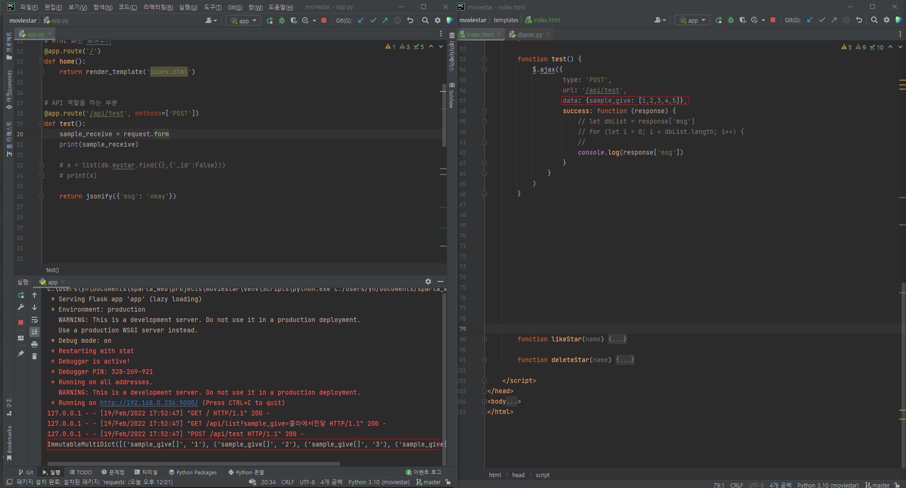
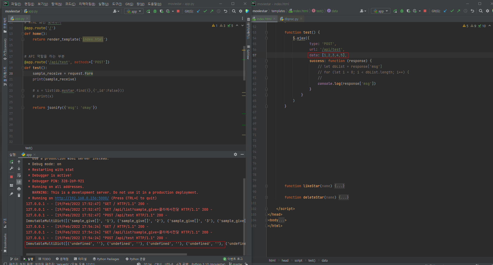
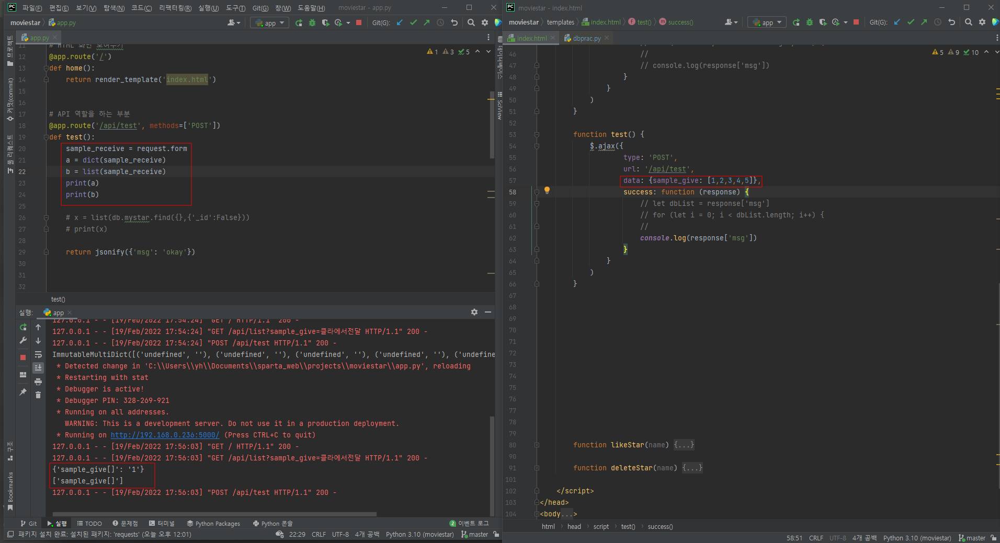

# jQuerry

에서 flask로 값을 전달하기. list등을 전달하려고 하면 잘 안된다. 아마 jquerry에서 값이 나갈 때 문제가 있는것 같은데 뭐가 문제일까?







안녕하세요!
 4~5주차에서는 서버(app.py)와 클라이언트(html페이지)가 ajax로 통신을 하는 경우가 많은데요, 클라이언트가 서버쪽로 정보를 보낼때는 다음과 같이 `data` 의 값으로 dictionary를 넣어서 보내줍니다.

```js
$.ajax({
    type: 'POST',
    url: '/api/like',
    data: {sample_give:'샘플데이터'},
...
```

그런데 제가 다음과 같이 저 data의 자리에 그냥 list도 넣어보고, key에 대응하는 value의 값으로서 list도 넣어보고 했는데요.

```js
data: [1,2,3,4,5]
data: {sample_give: [1,2,3,4,5]}
```

이게 이렇게 넘기면 넘어가서 받은 값을 app.py에서 쓰려면 잘 되지가 않더라고요. app.py에서 `list()` 등을 활용해서 받은 값을 python데이터 형식으로 바꿔보려고 해도 잘 되지 않고요.(이미지 첨부했습니다) 아마 js데이터가 python으로 넘어가는 과정에서 제가 지켜야할 형식을 잘 지키지 않았거나, 아니면 app.py내부에서 받은 데이터를 따로 처리를 해주고 가공을 했어야 하지 않았을까 싶은데요. 구글링으로 혼자 해결해보려고 했으나 답이 안나와서 찾다찾다가 이곳에서 이렇게 튜터님들의 도움을 구합니다.

1. 혹시 ajax로 post 요청을 할 때 data에서 지켜야할 형식이 구체적으로 어떻게 될까요? 또 list를 보내주고 싶으면 어떻게 처리를 해야할까요?
2. 반대로 flask에서 `return jsonify({'msg': 'okay'})` 할 때 지켜야할 형식이 있을까요?
3. ajax에서 보낼 때 datatype을 따로 지정하지 않으면 얘가 자동으로 지정해서 보낸다고 했는데, 어떤 규칙으로 자동으로 정해지는건지 궁금합니다.

```js
    //index.html   
    
    function test() {
            $.ajax({
                    type: 'POST',
                    url: '/api/test',
                    data: {sample_give: [1,2,3,4,5]},
                    success: function (response) {
                        // let dbList = response['msg']
                        // for (let i = 0; i < dbList.length; i++) {
                        //
                        console.log(response['msg'])
                    }
                }
            )
        }

```

```python
#flask의 파일
@app.route('/api/test', methods=['POST'])
def test():
    sample_receive = request.form
    a = dict(sample_receive)
    b = list(sample_receive)
    print(a)
    print(b)

    # x = list(db.mystar.find({},{'_id':False}))
    # print(x)

    return jsonify({'msg': 'okay'})
```


