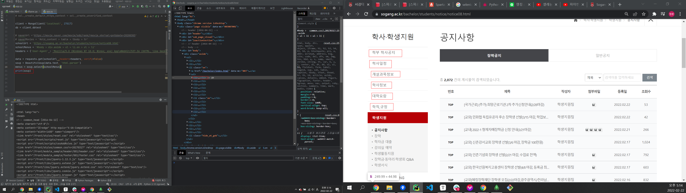
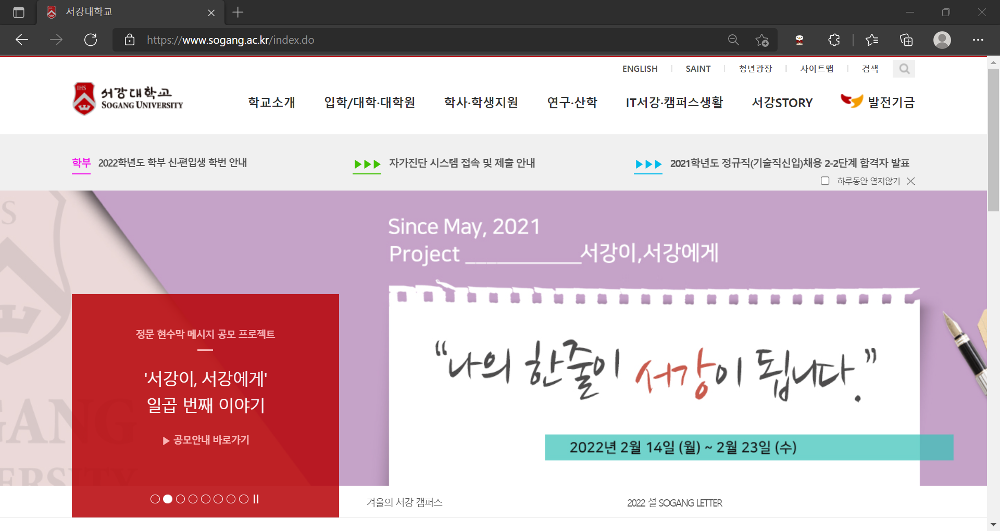
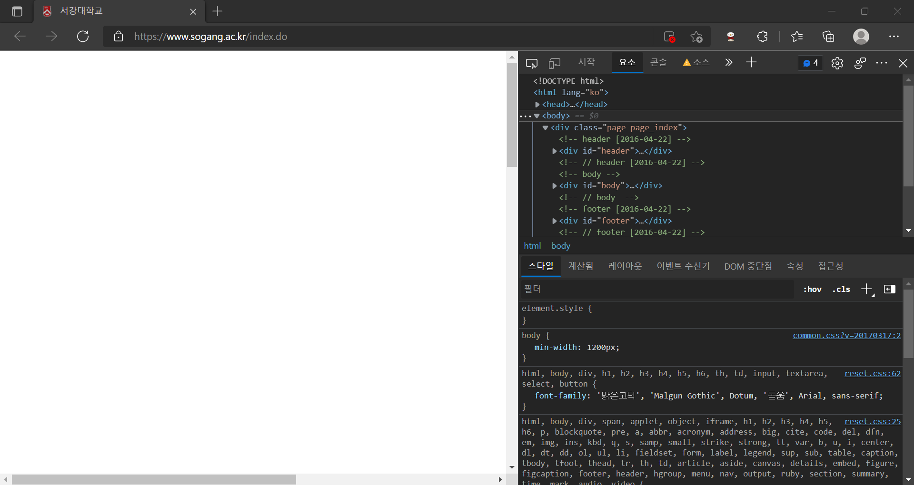
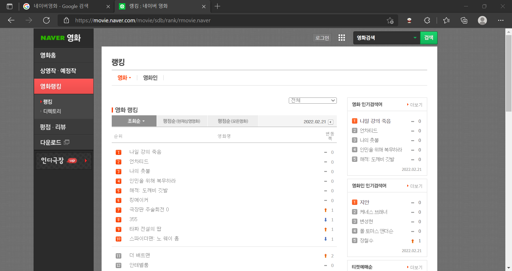
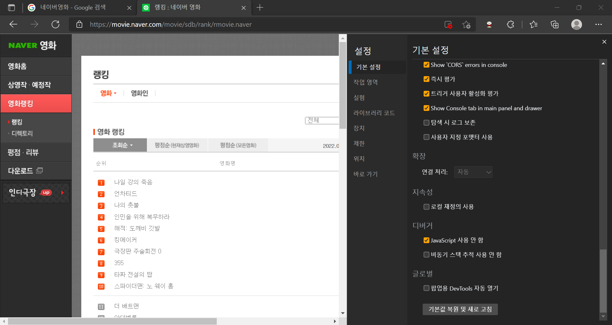

sparta web과정을 들으면서 내 개인적인 공부에 관한 포스팅을 전혀 쓰지 못했다..

사실 웹과정에서 배운것들도 더미? 포스팅 상태로 저장돼있긴 하는데, 진짜 낙서 수준으로 나만 알아볼 수 있게 돼있어서 블로그에 비공개상태로 올려놨다. 이것도 정리하고 publish 상태로 바꿔야하는데 지금 하는걸로 봐선 아주 요원하다 ㅋㅋ

# 문제상황

​	

여하튼, 교내 홈피의 장학금 목록을 크롤링해와서 정리하는 작업을 하려고 했는데.. 시작부터 문제가 생겼다.



전에 작성한 코드를 보면서 어떻게 어떻게 페이지를 가져오기는 했는데, HTML을 출력해서 보니까 온전하게 출력되지가 않는다. 정확히는 `head`부분만 잘 나오고 `body`는 거의 나오지 않는다. 직접 눈으로 봐가면서 비교해보니 주석과 일부 `div`테그 외에는 진짜 갖고오질 못했다. `print()` 했을 때 출력되는게 짧아서 혹시 html이 접힌채로.. 출력되는게 아닌가 생각까지 했다. 일단 html을 온전히 갖고와야 뭘 하든말든 할텐데 시작부터 이러니 무척 난감했다. 어제 `tr`부분이 iframe 안에 묶여있는건 확인해서 그 부분에서 막힐건 예상을 했는데 이렇게 벌써부터 막힐줄이야..

request 라이브러리 말고 또 url을 다룰 수 있는 urllib이란 라이브러리도 있어서 그것도 써봤는데 매한가지였다.

​	

## 원인은 (아마) JS였다

결론은 페이지 전체가 js가 매우 많았고, 도저히 selenium을 활용하지 않으면 크롤링을 할 수 없을것같다.

이는 개발자도구에서 js를 잠시 꺼봄으로서 알 수 있다.




이랬던 웹페이지가



js를 끄니까 이렇게 나온다. 사실상 아무것도 안보인다. 이게 표면적으로 보이는거랑 실제 크롤링이 가능한지의 유무는 사실 확실하지는 않다.

다만 문제없이 무난하게 크롤링이 가능했던 네이버영화 페이지를 보면 다음과 같이 js를 끄든 안끄든 보여지는게 완벽하게 똑같다. 



끄기 전



끄고 난 후

그리고 어차피 iframe부분에서 selenium을 꼭 써야할것 같기 때문에.. 그냥 처음부터 selenium으로 해야할것 같다. 또 배워야지..

다음은 내가 slack에 올렸던 질문 전문이다.

---


```
from pymongo import MongoClient
from flask import Flask, render_template, jsonify, request
from bs4 import BeautifulSoup
import requests
import ssl

# ssl._create_default_https_context = ssl._create_unverified_context

client = MongoClient('localhost', 27017)
db = client.dbtest

# naverUrl ='https://movie.naver.com/movie/sdb/rank/rmovie.nhn?sel=pnt&date=20200303'
# naverMovies = '#old_content > table > tbody > tr'
schoolUrl = 'https://sogang.ac.kr/bachelor/students/notice/notice08.html'
schoolMenus = '#body > div.aside > ul > li.on > ul > li'
headers = {'User-Agent' : 'Mozilla/5.0 (Windows NT 10.0; Win64; x64) AppleWebKit/537.36 (KHTML, like Gecko) Chrome/98.0.4758.102 Safari/537.36'}

data = requests.get(schoolUrl ,headers=headers, verify=False)
soup = BeautifulSoup(data.text, 'html.parser')
menus = soup.select(schoolMenus)
print(soup)
```

크롤링하려는 페이지는 'https://sogang.ac.kr/bachelor/students/notice/notice08.html' 입니다.
그런데 전체 페이지인 `soup`을 print했을때도, 또, select로 지정한 schoolMenus 만 프린트 했을때도, 제가 질제로 desktop에서 개발자도구로 보는것 html과 app.py에서 print해서 출력하는 내용이 다릅니다. 특히 head는 잘 나오는것 같은데 body가 거의 나오지 않고, 한글은 깨져서 나옵니다. 원인이 뭔지 모르겠습니다.. 일단 제대로 받아오기 하면 그 뒤에라 뭐라도 해볼텐데 잘 받아오는것 자체가 안되니까 진행이 안되네요 ㅠㅠ그리고 https페이지라서 그런것 같은데

```
requests.get(schoolUrl ,headers=headers, verify=False)
```

에서 파라미터로 verify=False를 넣지 않으면 에러가 뜨는데 혹시 다른 해결방법이 있을까요?마지막으로 같은 url에서 다른 요소를 또 크롤링하려고 하는데, 그게 iframe아래에 묶여있습니다. iframe아래에 있는 요소도 requests로 크롤링이 가능할까요?감사합니다