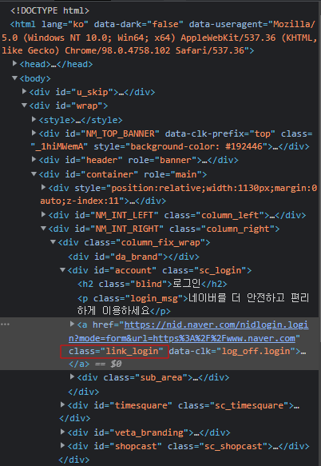
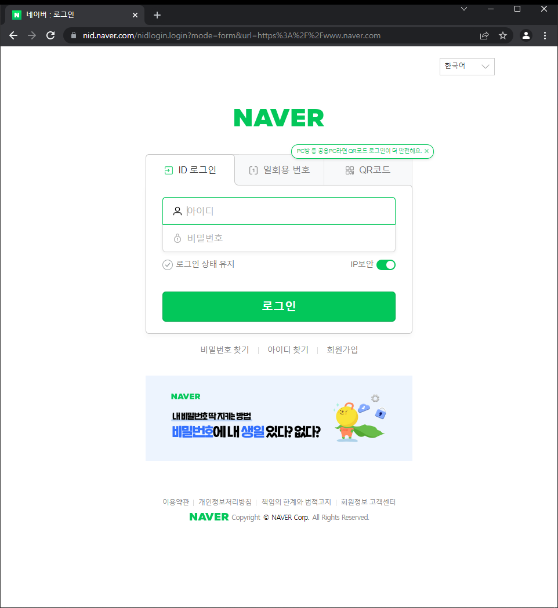

# xpath

웹페이지가 복잡해질수록 테그의 수도 많아진다. 이 많은 테그들에 쉽게 접근할 수 있게 해주는게 xpath다.

## 문법

예컨데 `body` 가 다음과 같이 주어져있다고 해보자.

```html
<학교>
    <학년 value="1학년">
        <반 value="1반">
            <학생 value='1-1-1'>김영훈</학생>
            <학생 value='1-1-2'>이홍국</학생>
            <학생 value='1-1-3'>이지원</학생>
            <학생 value='1-1-4'>박유빈</학생>
        </반>
    </학년>
    <학년 value="2학년"/>
    <학년 value="3학년"/>
</학교>

```

물론 저런 이름의 테그는 없지만.. 이렇게 많은 테그 속에서 딱 내가 원하는것에 접근하려고 하면

`/학교/학년/반/학생[3]`

이라고 하면 이지원에 접근하는 것이다. 여기서 `[]`는 n번째 요소라는 뜻이다

또는, 무조건 `id`로만 찾으려면

`//*[@id='login']` 이런식으로 찾는다. slash가 *하나*면 내 디렉토리 바로 아래 디렉토리란 뜻이고, slash가 *두개*면 지금 위치로부터 모든 하위 엘리먼트들에 대해서 다 찾아본다. 참고로 저 `value` 등의 값은 어트리뷰트라고 한다. `*`은 테그(엘리먼트) 값에 상관없이 다 찾는다는 뜻이다.

​	

# requests

​	

```python
res = requests.get('http://www.nadocoding.tistory.com/')
```

으로 원하는 url을 가져온다.

```
res.status_code
```

는 돌아오는 코드를 출력한다. 200이면 정상. 에러처리를 if/else로 해줘도 되지만

```
res.raise_for_status()
```

를 쓰면 에러가 안나면(200이면) 쭉 진행하고, 에러가 나면 에러코드 토해내고 거기서 멈춘다.

```
print(res.text)
```

`.text`로 가져온걸 출력할 수 있다. 정상적으로 가져왔으면 html전체가 출력된다

​	

# selenium

터미널에서 진행하는것 기준으로 서술한다


```python
from selenium import webdriver
```

으로 먼저 불러와주고, webdriver를 다운받는다. 이 때 내가 사용하는 chrome의 버전과 맞는 webdriver를 받아야함에 유의하자. 그 전에 먼저 `python` 이라고 터미널에 입력하는거 잊지말자

```python
browser = webdriver.Chrome()
```

으로 시작한다.

터미널에서 조작하면 

```python
browser.get('http://naver.com')
```

이라고 하면 바로 열린다.

여기서 로그인 창을 열고싶으면 먼저 개발자도구에서 해당 엘리먼트를 살펴보자



보니까 class명이 `link_login`이다. 이걸 바탕으로 하면

```python
elem = browser.find_element_by_class_name('link_login')
```

`elem`에 저 로그인 버튼이 똭!! 저장이 된다. 뭐 구문이 너무 직관적이여서 바로 이해가 간다.

그리고

```python
elem.click()
```

으로 실행하면



로그인창이 뜬다!!

그 외의 문법들은 다음과 같다.

```python
browser.click()
browser.back()
browser.forward()
browser.refresh()
browser.back()
```


이번엔 주소창에 접근해보자. 이번엔 id값으로 접근한다.

```
 elem = browser.find_element_by_id('query')
```


`Keys.Enter` 를 사용하기 위해, 다음과 같은 라이브러리를 또 갖다쓴다.

```
from selenium.webdriver.common.keys import Keys
```


```
elem.send_keys('나도코딩')
```

라고 하면 입력이 된다 주소창에. 


그리고 검색하려고 엔터를 누른다. 이 때 `send_keys` 까지는 같으나, 괄호 안에 따움표 없이 바로 들어간다는 것에 주의하자.

```
 elem.send_keys(Keys.ENTER) 
```


이제까지는 `id`, `classname` 으로 가져왔는데, `tagname`으로 가져올수도 있다. 모든 `<a>` 를 가져와보자 

```
elem = browser.find_find_element_by_tag_name_by_tag_name('a')
```

이렇게 치면

```
<selenium.webdriver.remote.webelement.WebElement (session="b268b1ebb9c0ca585f62c26f79e21147", element="9658786c-
54e7-4a12-afa5-aab8b62abbdf")>
```

이렇게 딱 한줄만 나온다. 왤까? element를 써서 그렇다. 만약 페이지에 있는 모든 해당요소를 찾고싶다면 `elements` 로 하자. elements 로 바꿔서 하면.. 여기에 적을 수 없을만큼 많이 나온다.

만약 여기서 가져온 a테그들의 href정보만 가져오고 싶으면 어떻게할까?

```python
for e in elem:
    elem.get_attribute('href')
```

터미널에서 한다면 line2 indent에 주의하자

​	

이제 다른 페이지로 한번 이동해보자.

```
browser.get('http://daum.net')
```

마찬가지로 검색창에 접근하려고 하는데, class, tag, id 다 해봤으니 name과 xpath로 찾아보자. 거의 같다.

```
elem = browser.find_element_by_xpath('')
elem = browser.find_element_by_name('')
```

이다.


서치박스 돋보기 아이콘의 `xpath`를 따왔다.

```
//*[@id="daumSearch"]/fieldset/div/div/button[2]
```

인데, xpath복습을 할겸 하나하나 살펴보면,

`//*[@id="daumSearch"]` : html의 모든 부분중에서 id가 daumSearch인 애를 찾는다. id니까 당연히 하나밖에 없다.

`/fieldset/div/div/button[2]` : 여기까지 실제로 들어가봤는데, 당연하겠지만 구조가 딱 맞았다. slash로 접근하는 부분은 전부 tag다. 그러니까 id=daumSearch 아래에 fieldset라는 테그가 진짜 딱 하나밖에 없었고, 그 아래에도 div가 딱 하나 있었고 그 아래에도 div가 하나만 있었다. 다만 button은 두개가 있었어서 [2]가 들어가야 한다.왼쪽이 btn1 이고 오른쪽이 내가 찾는 btn2였다. 


브라우저의 tab을 닫으려면 `browser.close()`, 전체를 다 닫으려면 `browser.quit()`

그 외에 입력된 값 clear, html정보를 출력하는 방법은 다음과 같다.

```python
elem = browser.find_element_by_id('pw').clear()
print(browser.page_source)

```


처음부터 끝까지 각주를 넣어가면서 찾아봤다.

```python
from selenium import webdriver

browser = webdriver.Chrome()

#네이버로 이동
browser.get('https://www.naver.com/')

# 로그인버튼 클릭
elem = browser.find_element_by_class_name('link_login')
elem.click()

#id와 pw 입력
elem = browser.find_element_by_id('id').send_keys('xxx')
elem = browser.find_element_by_id('pw').send_keys('xxx')

#로그인버튼 클릭
browser.find_element_by_id('log.login').click()

#기입력된 id 지우기
elem = browser.find_element_by_id('pw').clear()

#html 정보 출력
print(browser.page_source)

```


## 네이버 항공권 스크래핑

강의영상이랑 일단 현재의 웹사이트 구조가 매우 달라서 거의 xpath밖에 못썻는데..


```python
browser.maximize_window() # 창 최대화
```


이거 중요하다. 뭔가 안된다 싶으면 일단 넣어보자.

```python
time.sleep(1)
```

예컨데 'cju' 라고 검색창에 입력하고 그 뒤에 하나를 선택하는걸 구현한다고 하면, 당연히 cju를 입력하고 시간이 조금 지나야 그 리스트가 뜰거임. 그럼 그 시간까지를 줘야함


이것도 매우 중요하다. 어떤 elem이 로딩되는데 시간이 쫌 걸리면, 그걸 바로 실행하지 않고 그 elem이 로딩될때까지 기다린다. import 까먹지 말고!!!!

```python
from selenium.webdriver.common.by import By
from selenium.webdriver.support.ui import WebDriverWait
from selenium.webdriver.support import expected_conditions as EC

elem = WebDriverWait(browser, 10).until(EC.presence_of_element_located((By.XPATH, ...xpath주소...))
                                        
# WebDriverWait : 를 통해서 browser를 최대 10초간 기다려라. 10초가 넘어가면 에러가 나고 끝남
# until : 단, 10초 안에 뭔가 나오면(뒤의 조건) 충족되면 바로 진행을 함
# EC : expected conditions의 약어. 즉, 뒤의 조건
# presence_of_element_located : 뒤의 나오는 요소가 생기면 된다
# By : XPATH 외에도 ID, CLASS_NAME, LINK_TEXT 등 다양하다                                       
# 즉, 뒤의 조건이 로딩될때까지 뒤의 browser 명령 실행을 잠시 멈추는것이다
         
                       
```


LINK_TEXT는 a테그의 text값에만 쓰인다.


```python
elem.text
```

하면 해당 엘리먼트의 텍스트값을 토해낸다


try/finally 는, 일단 무조건 try를 시도해보고, try가 끝나면 finally를 실행한다. 그니까 아래 구문같은 경우에는 성공하면 성공하고 브라우저가 닫힐거고, 실패하면 또 실패하는데로 바로 닫힐거다.

```python
try :
    elem = WebDriverWait(browser, 10).until(EC.presence_of_element_located((By.XPATH, ...xpath주소...))
finally :
     browser.quit()                                       

```
